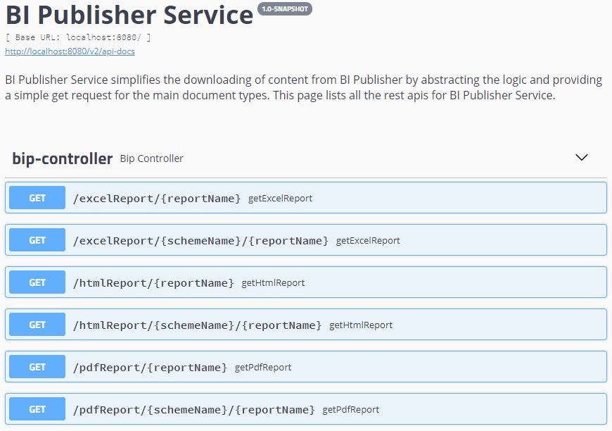

# BI Publisher Service API

This is a very simple api designed to simplify the process of getting reports from a BI Publisher service.

You must specify the address of your BI Publisher server and the username and password in the application.properties file. 
```yaml
report.service.url=<BIP url goes here>
report.service.username=<BIP username goes here>
report.service.password=<BIP password goes here>

```

You can run this application as a conventional spring boot application using:
```shell
mvn spring-boot:run
```
Alternatively you can package it into a  war for deployment to Weblogic or Tomcat using:
```shell
mvn clean package
```
If running as a spring boot app the context root will be the default root, on Weblogic or Tomcat it will be bip.

Once the application is running you can see a list of the endpoints by going to <url>/swagger-ui.html 


